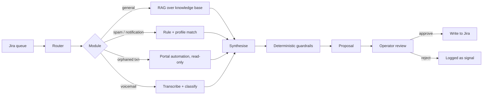
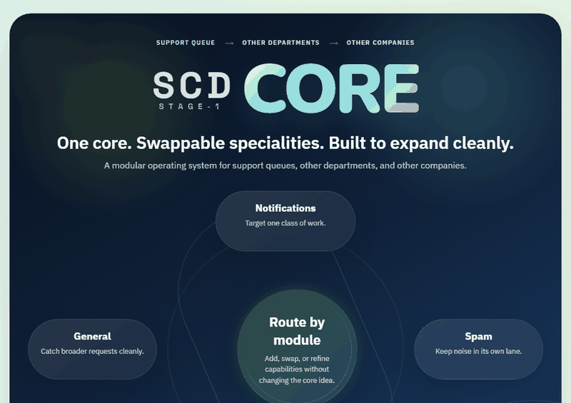
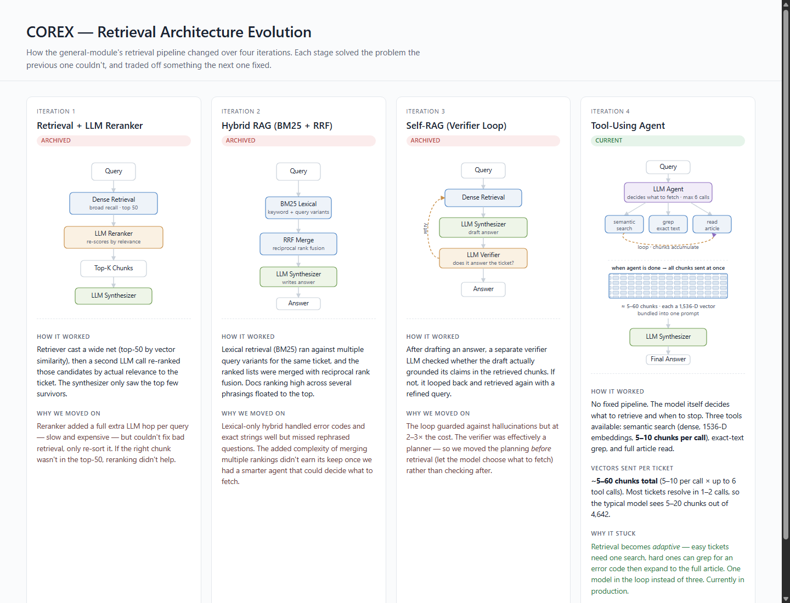
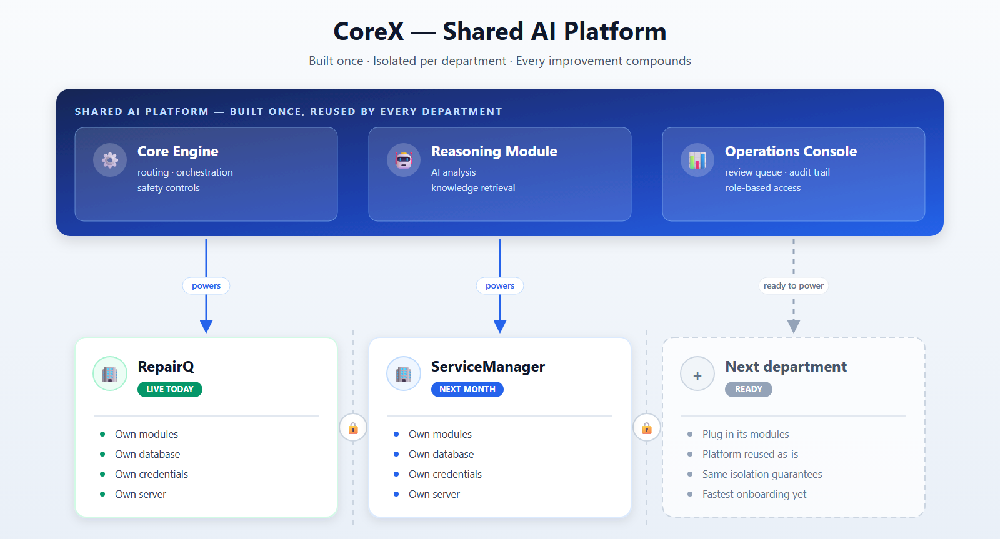

# COREX — AI Agent for Live Support Operations

An autonomous agent that works a Jira support queue like a tier-1 engineer:
it reads each incoming ticket, classifies it, drafts the fix or reply, and
files its work for human sign-off.


> **Case Study Overview:** The source code and live queue integration live in a private enterprise repository — full architecture walkthroughs and live execution are available to reviewers on request. All company, client, and personal identifiers have been sanitized with an automated CI-enforced privacy pipeline.

---

## The problem

A device-repair support desk handled tens of thousands of Jira tickets a year —
how-to questions, voicemail transcripts, vendor spam, automated notifications
and payment-reconciliation requests. Volume grew roughly six-fold between 2023
and 2025 (5,284 → 31,881 tickets/year). Most tickets followed repeatable
patterns, yet each still consumed tier-1 minutes.

## Evidence before automation

Before automating anything, I measured what was actually there. Across **50,631
production tickets**:

| | |
|---|---|
| Closed with **zero human comments** | 33,536 (66%) |
| Notification-class traffic | 29,153 (58%) |
| ...of those, closed with zero comments | **27,594 (95%)** |
| One alert profile alone | 1,340 tickets → 1,333 zero-comment (99.5%) |

That 95% is the number that mattered. A ticket closed without a single comment
is a ticket nobody thought about — someone opened it, recognised it as noise and
closed it. It is pure clicking, and it is safe to automate precisely because no
judgement was ever applied.

Initial notification automation removed roughly **150 tickets a week**, returning an estimated **13 hours a week** of manual triage. Expanding the system across 5 specialized resolution modules and policy-grounded priority adjustment scaled operational impact to **273 tickets/week and ~60 hours/week saved** (as tracked in the live dashboard above).

## The system



**Fetch** a read-only Jira client pulls full ticket context. **Route**
deterministic classification into one of five modules, validated against a
whitelist so the router cannot invent an action. **Resolve** the matched module
does the work. **Gatekeep** a deterministic output firewall inspects the result.
**Propose** everything lands in a dashboard as a proposal — never a silent write.

### Modules

| Module | Approach |
|---|---|
| General | Tool-using RAG agent: semantic search over 1536-dim embeddings, grep, article reader, capped at 6 tool calls |
| Orphaned transactions | Playwright automation against the payments back-office, read-only enforced by test |
| Voicemail | Transcription, then robocall vs. genuine-callback classification |
| Spam | Sender and domain profile matching |
| Notifications | Automated-alert triage and auto-close |

The general module segments multi-question tickets into up to three
sub-questions, runs each through its own agent loop, then merges the drafts.
Every reply carries an a/b/c/d decision: full answer, partial plus clarifier,
clarifier only, or "this needs a capability we don't have yet".

## Engineering decisions worth defending

**LLM-graded output was unstable, so I removed the LLM from grading.**
Early versions scored reply tone with a model; identical drafts got different
verdicts run to run. I replaced it with ~30 deterministic regex guardrails —
researcher framing, deflection, missing greeting, wiki-URL leaks. Violations
produce structured records that feed targeted retry prompts. Convergence went
from flip-flopping to reliable within two retries.

**Safety assumes the model misbehaves.** Prompt-injection detection, secret
solicitation blocking (API keys, PEM blocks, bearer tokens), HTML/SQL checks,
and per-module confidence bands. Separate read and write Jira tokens.
Idempotent scan state. A strict execution contract: any failed step halts the
pipeline rather than guessing.

**Trust is granted incrementally.** Four roles (viewer, expiring temp viewer,
operator, admin), 18 feature toggles, invite-based signup, and per-module
execution policies — dry-run, manual, or auto-execute once a module has earned
it.

**Quality is measured, not assumed.** Operator accept/reject decisions are
human labels, which makes routine review a continuous eval set. The dashboard
reports acceptance, rejection and refinement rates, quarantine and error rates,
and a confidence-calibration curve — acceptance rate per confidence band. A
flat curve means the confidence score is decoration, no matter how good the
headline number looks.

## Making it publishable

Publishing meant proving no real customer data survived. I built a separate
deterministic anonymization pipeline: brand and subdomain rewriting, structured
field harvesting, and 60+ regex rules covering phones, emails, addresses and
card numbers in free text — including voicemail-transcript artefacts where a
number arrives as `352391. 4827`.

Two independent scanners then cross-checked the output against an inventory
built from the original data. That is also now a **CI gate**: every phone number
must use the 555 reserved exchange, every email must sit on a reserved
`example` domain or an explicit allowlist, and the build fails otherwise.

The gate earned its place immediately — it caught 24 real phone numbers that my
first two verification passes had missed, in UK and Chinese formats buried
inside email signatures.

## Architecture Evolution & Project Progression

The project was not built in a single leap — it progressed through structured architectural intervals, moving from initial concept and single-queue automation to a multi-stage cognitive platform and an enterprise multi-department foundation.

### 1. Stage-1 Architecture & Foundation (Interactive Showcase)

The initial version proved the thesis: a decoupled core engine coordinating specialized, swappable resolution modules (notifications, spam, general, and deep workflows) with an asynchronous orchestrator and deterministic gatekeeping.



> 🌐 **Live Interactive Showcase (No Download Needed):**  
> Experience the full prototype live with CSS orbital particle loops, interactive step-by-step orchestrator tabs, and module switching directly in your browser:  
> 👉 **[https://engineeringbro.github.io/corex-case-study/](https://engineeringbro.github.io/corex-case-study/)** *(or open [docs/stage-1-showcase.html](docs/stage-1-showcase.html) locally)*

```
Stage 1: Cognitive Engine  →  Stage 2: Machine Learning  →  Stage 3: Symbolic Reasoning  →  Stage 4: Neuro-Symbolic AI
(Modular routing & flow)      (Pattern & score learning)    (Deterministic rule engine)     (Production synthesis)
```

---

### 2. Retrieval Evolution (RAG Across 4 Iterations)

The general-module retrieval architecture evolved across four distinct iterations. Each phase resolved the failure modes of the previous design until arriving at the production tool-using agent:

[](docs/rag-evolution.html)

*Interactive comparison available in [docs/rag-evolution.html](docs/rag-evolution.html).*

| Iteration | Architecture | How It Worked | Why We Moved On |
|---|---|---|---|
| **1. Archived** | Dense Retrieval + LLM Reranker | Top-50 vector search filtered by a second LLM reranking hop. | Reranker added latency & cost without fixing recall misses (if the answer was not in top-50, reranking could not recover it). |
| **2. Archived** | Hybrid RAG (BM25 + RRF) | Keyword search with multiple query variants merged via Reciprocal Rank Fusion. | Handled error codes well but missed semantic paraphrasing. Complex rank merges didn't earn their keep once agentic search emerged. |
| **3. Archived** | Self-RAG (Verifier Loop) | LLM synthesizer drafted an answer; a separate LLM verifier checked grounding and looped back if unsupported. | Guarded against hallucinations but doubled/tripled inference costs. Verifier was acting like a planner *after* retrieval. |
| **4. Current (Prod)** | **Tool-Using Agent** | Single agent dynamically selects tools (`semantic_search`, `exact_grep`, `read_article`), accumulating 5–60 chunks max before final synthesis. | **Adaptive**: easy tickets need 1 tool call; hard ones grep exact codes and expand. One model in the loop, zero reranking overhead. |

---

### 3. Scaling to a Shared Multi-Department Platform

Once operational stability and safety guardrails were proven on the primary queue, COREX transitioned from an isolated queue tool into an extensible platform. The core engine, reasoning module, and operations console were decoupled so new business departments can onboard with zero cross-tenant leakage:



- **Isolated execution contexts:** Independent tenant databases, encrypted credentials, dedicated servers, and custom domain modules.
- **Compounding platform improvements:** Upgrades to the core router, guardrail firewalls, confidence calibration, and operator review tooling immediately benefit every connected department.

---

## Scale

| Metric | Measured Impact |
|---|---|
| Historical tickets analysed | 50,631 (2023–2026) |
| Automatable share identified | 58% (29,153) |
| Production run-rate | **273 tickets/week · ~60h/week saved** |
| Overall resolution rate | **87%** (24% autonomous · 63% human-confirmed) |
| Knowledge-base articles | 654, chunked and embedded (1536-dim) |
| Active modules | 5 resolution modules + priority adjustment |
| Pipeline latency | 0.4s auto-execute · 0.2s write execution |
| Dashboard routes | 35 |
| Access control | 4 roles, 18 feature toggles |

## Stack

Python · Django · SQLite · Docker + Caddy + gunicorn · GitHub Actions ·
OpenAI and Anthropic models via API · embeddings-based RAG · Playwright ·
faster-whisper

Model routing is cost-tiered: a small model rewrites, a mid model synthesises,
a frontier model backs the experimental Labs tools.

## Demo & Technical Walkthrough

Detailed architecture walkthroughs, system diagrams, and live execution demos of the operator interface, prompt/eval loops, and database automation can be demonstrated during technical interview rounds.

---

**Hussein Shaib** — [LinkedIn](https://www.linkedin.com/in/hussein-shaib/) · [GitHub](https://github.com/EngineeringBro)  
*Full source code and live demo available to reviewers on request.*
