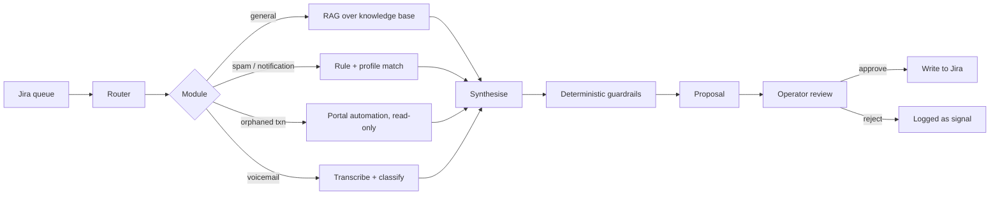
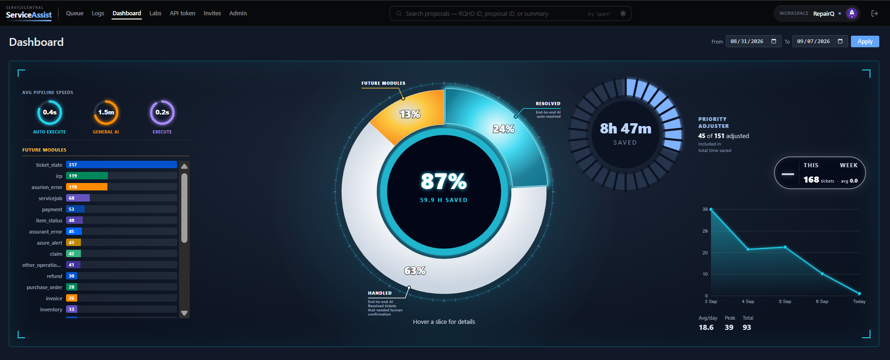

# COREX — AI Agent for a Live Support Queue

An autonomous agent that works a Jira support queue like a tier-1 engineer:
it reads each incoming ticket, classifies it, drafts the fix or reply, and
files its work for human sign-off.

This repository is the **case study**. The source code lives in a private
repository — available to reviewers on request.

> All company, client and person names shown here are fictional. The system
> was built against real production traffic; everything public was put through
> a custom anonymization pipeline and verified by independent scanners.

---

## The problem

A device-repair support desk handled tens of thousands of Jira tickets a year —
how-to questions, voicemail transcripts, vendor spam, automated notifications
and payment-reconciliation requests. Volume grew roughly six-fold between 2023
and 2025 (5,284 → 31,881 tickets/year). Most tickets followed repeatable
patterns, yet each still consumed tier-1 minutes.

## Evidence before automation

Before automating anything, I measured what was actually there. Across **50,631
production tickets**:

| | |
|---|---|
| Closed with **zero human comments** | 33,536 (66%) |
| Notification-class traffic | 29,153 (58%) |
| ...of those, closed with zero comments | **27,594 (95%)** |
| One alert profile alone | 1,340 tickets → 1,333 zero-comment (99.5%) |

That 95% is the number that mattered. A ticket closed without a single comment
is a ticket nobody thought about — someone opened it, recognised it as noise and
closed it. It is pure clicking, and it is safe to automate precisely because no
judgement was ever applied.

Automating that class removed roughly **150 tickets a week**, an estimated **13
hours a week** of manual triage (at the 5-minute-per-ticket handling estimate
used in the internal metrics).

## The system

**Fetch** a read-only Jira client pulls full ticket context. **Route**
deterministic classification into one of five modules, validated against a
whitelist so the router cannot invent an action. **Resolve** the matched module
does the work. **Gatekeep** a deterministic output firewall inspects the result.
**Propose** everything lands in a dashboard as a proposal — never a silent write.

### Modules

| Module | Approach |
|---|---|
| General | Tool-using RAG agent: semantic search over 1536-dim embeddings, grep, article reader, capped at 6 tool calls |
| Orphaned transactions | Playwright automation against the payments back-office, read-only enforced by test |
| Voicemail | Transcription, then robocall vs. genuine-callback classification |
| Spam | Sender and domain profile matching |
| Notifications | Automated-alert triage and auto-close |

The general module segments multi-question tickets into up to three
sub-questions, runs each through its own agent loop, then merges the drafts.
Every reply carries an a/b/c/d decision: full answer, partial plus clarifier,
clarifier only, or "this needs a capability we don't have yet".

## Engineering decisions worth defending

**LLM-graded output was unstable, so I removed the LLM from grading.**
Early versions scored reply tone with a model; identical drafts got different
verdicts run to run. I replaced it with ~30 deterministic regex guardrails —
researcher framing, deflection, missing greeting, wiki-URL leaks. Violations
produce structured records that feed targeted retry prompts. Convergence went
from flip-flopping to reliable within two retries.

**Safety assumes the model misbehaves.** Prompt-injection detection, secret
solicitation blocking (API keys, PEM blocks, bearer tokens), HTML/SQL checks,
and per-module confidence bands. Separate read and write Jira tokens.
Idempotent scan state. A strict execution contract: any failed step halts the
pipeline rather than guessing.

**Trust is granted incrementally.** Four roles (viewer, expiring temp viewer,
operator, admin), 18 feature toggles, invite-based signup, and per-module
execution policies — dry-run, manual, or auto-execute once a module has earned
it.

**Quality is measured, not assumed.** Operator accept/reject decisions are
human labels, which makes routine review a continuous eval set. The dashboard
reports acceptance, rejection and refinement rates, quarantine and error rates,
and a confidence-calibration curve — acceptance rate per confidence band. A
flat curve means the confidence score is decoration, no matter how good the
headline number looks.

## Making it publishable

Publishing meant proving no real customer data survived. I built a separate
deterministic anonymization pipeline: brand and subdomain rewriting, structured
field harvesting, and 60+ regex rules covering phones, emails, addresses and
card numbers in free text — including voicemail-transcript artefacts where a
number arrives as `352391. 4827`.

Two independent scanners then cross-checked the output against an inventory
built from the original data. That is also now a **CI gate**: every phone number
must use the 555 reserved exchange, every email must sit on a reserved
`example` domain or an explicit allowlist, and the build fails otherwise.

The gate earned its place immediately — it caught 24 real phone numbers that my
first two verification passes had missed, in UK and Chinese formats buried
inside email signatures.

## Scale

| | |
|---|---|
| Tickets analysed | 50,631 (2023–2026) |
| Automatable share identified | 58% (29,153) |
| Knowledge-base articles | 654, chunked and embedded |
| Modules | 5 active, plus a future-capability taxonomy |
| Dashboard routes | 35 |
| Access control | 4 roles, 18 feature toggles |

## Stack

Python · Django · SQLite · Docker + Caddy + gunicorn · GitHub Actions ·
OpenAI and Anthropic models via API · embeddings-based RAG · Playwright ·
faster-whisper

Model routing is cost-tiered: a small model rewrites, a mid model synthesises,
a frontier model backs the experimental Labs tools.

## Demo

The live operational dashboard tracks automated pipeline speeds, module resolution ratios (auto-resolved vs. human-confirmed), estimated time saved, and upcoming module candidates. Detailed walkthroughs and live execution demos are available during technical reviews.

---

**Hussein Shaib** — [LinkedIn](https://www.linkedin.com/in/hussein-shaib/) ·
source available to reviewers on request.
